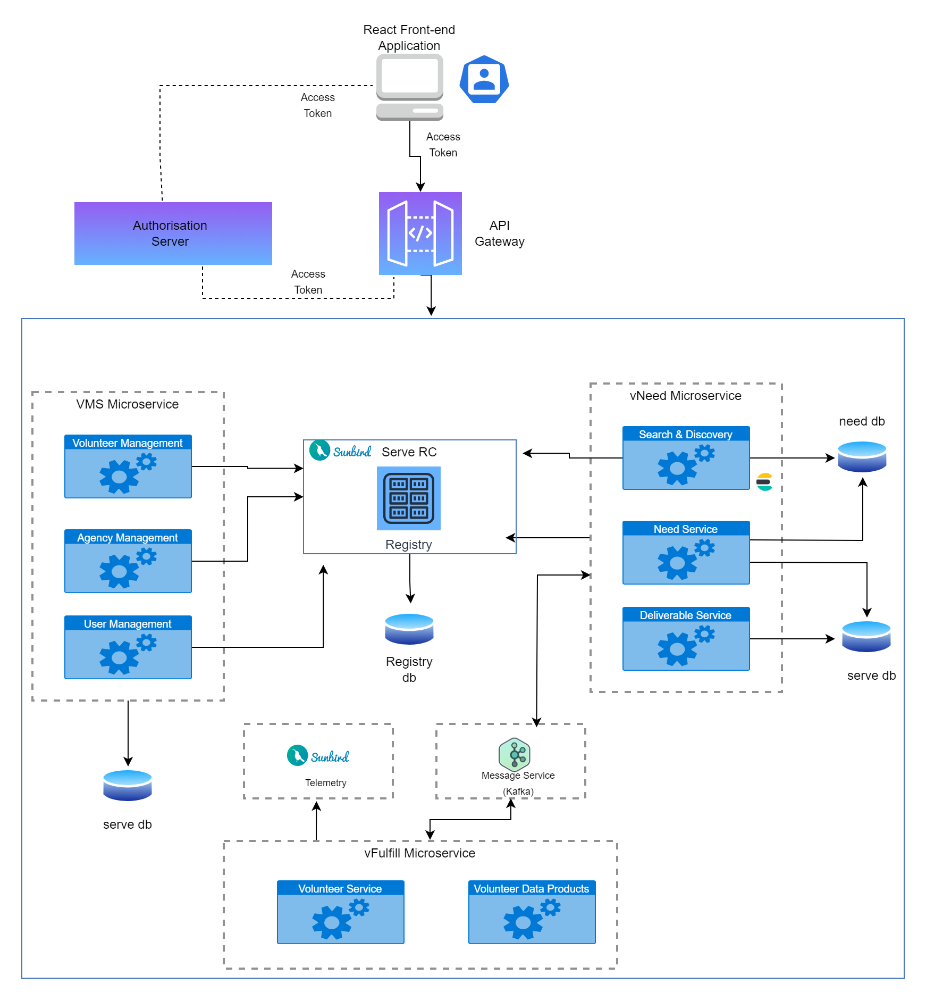

# Technical Architecture

The technical architecture diagram showcasing a robust and scalable system design. This diagram illustrates the architecture of a sophisticated application comprising microservices, databases, an authorization server, a message broker, and an API gateway. By leveraging these interconnected components, this architecture enables seamless communication, efficient data storage and retrieval, secure access control, and reliable message distribution. Each element plays a vital role in empowering the system to deliver high-performance, fault-tolerant, and extensible solutions. Let's dive into the details and explore the intricacies of this well-structured technical architecture [here](../explore/product-and-developer-guide.md).

<figure><figcaption>
Sunbird Serve Technical Architecture
</figcaption></figure>

