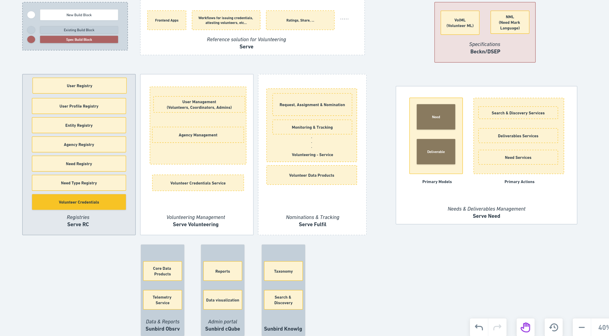

# Solution Architecture

The solution architecture for Sunbird Serve embodies a comprehensive and scalable approach. At its core, the architecture embraces a microservices-based design, which promotes modularity, flexibility, and independent scalability. The three microservices, carefully designed and encapsulated, provide specific functionalities while maintaining loose coupling and high cohesion.&#x20;

Leveraging some of Sunbird building blocks like Sunbird RC to include next generation electronic registry, Sunbird Telemetry to collect real-time data and Sunbird cQube for analytics.

To facilitate reliable communication and asynchronous processing, a message broker is integrated, enabling the seamless exchange of messages and event-driven workflows. Lastly, an API gateway acts as a centralized entry point, offering a unified interface and enforcing consistent governance and security policies. Together, these components create a robust and flexible solution architecture that can cater to the evolving demands of the application while ensuring optimal performance and maintainability.

<figure><figcaption></figcaption></figure>
