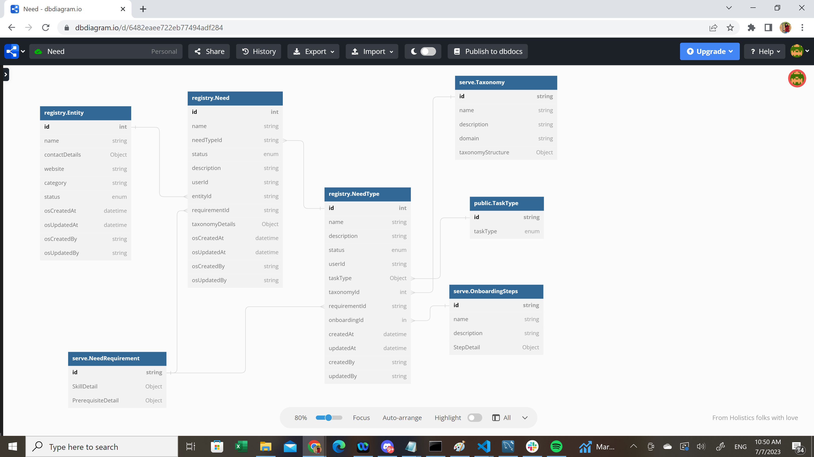
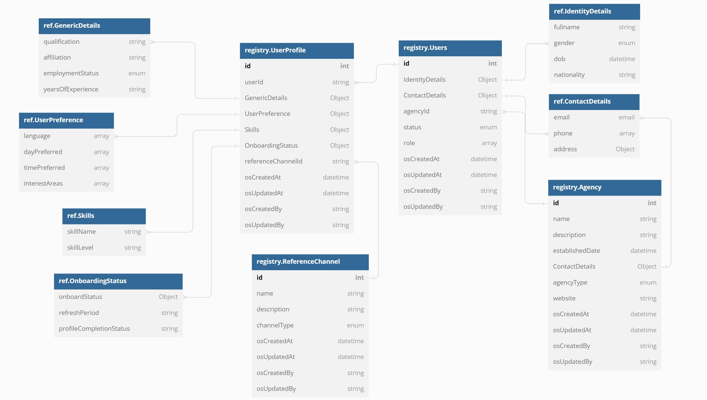

# Schema Design

### Need and Need Type Flow

Please find below a visual representation of the Need and Need Type schema details. To access the JSON files, please click below links.&#x20;

Need Registry, NeedType Registry and Entity Registry - [Link](https://github.com/Sunbird-Serve/sunbird-serve-need/tree/main/schemas/registry)

Taxonomy, Onboarding Steps and Need Requirement - [Link](https://github.com/Sunbird-Serve/sunbird-serve-need/tree/main/schemas/serve)

<figure><figcaption></figcaption></figure>

### Need Plan, Need Deliverable and Fulfillment Flow

Please find below a visual representation of the Need Plan, Need Deliverable and Nomination schema details. To access the JSON files, please click below links.

Need Plan - [Link](https://github.com/Sunbird-Serve/sunbird-serve-need/tree/main/schemas/serve)

Need Deliverables - [Link](https://github.com/Sunbird-Serve/sunbird-serve-need/tree/main/schemas/serve)

Nomination and Fulfillment Details - [Link](https://github.com/Sunbird-Serve/sunbird-serve-fulfill/tree/main/schema/serve)

<figure><figcaption></figcaption></figure>

### Volunteering

Please find below a visual representation of the Users, User Profile and Agency Registry Schema details. To access the JSON files, please click below links.

User and User Profile Registry - [Link](https://github.com/Sunbird-Serve/sunbird-serve-volunteering/tree/main/schema/registry)

Agency and Reference Channel Registry - [Link](https://github.com/Sunbird-Serve/sunbird-serve-volunteering/tree/main/schema/registry)

<figure><figcaption></figcaption></figure>
