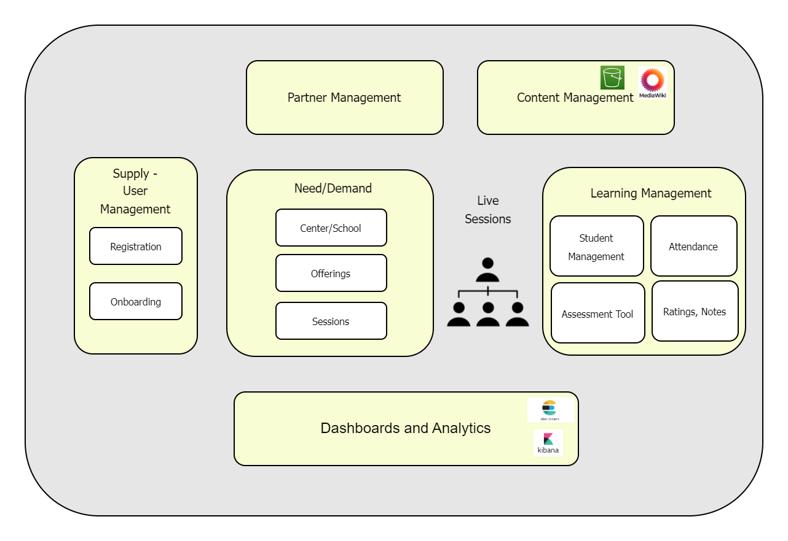

# Solution Architecture - Serve V0

<figure><figcaption></figcaption></figure>

**1) Supply Side: User/Volunteer Management and Onboarding** Streamlining user interactions, SERVE V0 provides a volunteer-centric approach with a robust registration and onboarding process. Volunteers can effortlessly join the ecosystem, complete self-evaluation, and even engage in teacher selection process, ensuring the perfect match between volunteers and students.

**2) Demand Side: Course Creation and Offering Management** SERVE V0 architecture bridges the demand for courses with the available supply, within centers offerings can be created aligning with students needs. Post offering creation, with sessions scheduled based on start and end dates, and durations.&#x20;

**3) Learning Management:** Learning management system manages students progress, attendance records, and scores. Comprehensive assessment tools ensure a thorough understanding of each student's development.

**4) Content Management:** Content management system presents an organized repository of courses, topics, and subtopics. Dive deep into content details, ensuring that volunteers and students have access to a wealth of educational resources. This arrangement ensures self-directed learning too.

**5) Interactive Gmeet Sessions** Leveraging the power of technology, live sessions are seamlessly conducted through Gmeet. This feature enhances the virtual classroom experience, enabling real-time interaction between volunteers and students regardless of geographical barriers.

**6) Informative Dashboards** Our architecture offers a suite of dashboards catering to various stakeholders. Operation dashboards provide insights into the platform's functioning, while volunteer and user dashboards enable seamless communication and collaboration. Additionally, demand and student dashboards empower educators with real-time data on enrollment and engagement.
