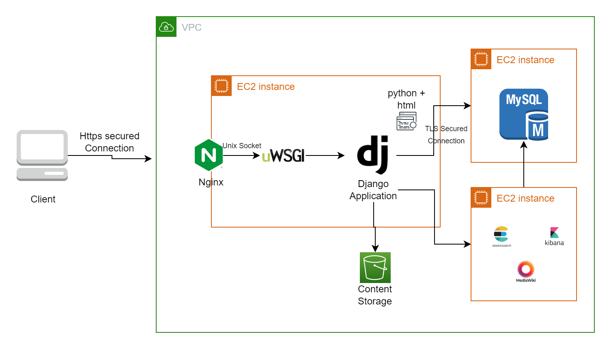

# Technical Architecture - Serve V0

<figure><figcaption></figcaption></figure>

**1. Web Application Tier: EC2 Instance 1**

This EC2 instance hosts the web application components using the Django framework, Python, and HTML. Here's how it's structured:

* **Nginx:** Serves as a reverse proxy server, handling incoming requests and distributing them to the appropriate services. It also manages SSL termination for secure connections.
* **uWSGI:** Acts as the application server, serving the Django application and managing communication between Nginx and the Django application. It handles the execution of Python code.
* **Django Application:** This is the core of the platform, responsible for handling user management, course creation, offering management, learning management, student management, and more.
* **HTML and Front-End:** The user interface is built using HTML, CSS, and potentially JavaScript. It interfaces with the Django backend to present a seamless experience to users.

**2. Database Tier: EC2 Instance 2**

This EC2 instance hosts the MySQL database, which stores all application-related data. It includes user information, course content, student records, learning outcomes, and more.&#x20;

**3. ELK Stack Tier: EC2 Instance 3**

The ELK (Elasticsearch, Logstash, Kibana) stack provides robust data visualization, analysis, and search capabilities.

**4. MediaWiki Tier: EC2 Instance 3**

Hosts content repository. It allows volunteers/users to create, edit, and organize educational content. This can include instructional materials, resources, and other content to enhance the learning experience.

**5. Amazon S3 for Content Storage**

Amazon S3 is used to store content files such as images, videos, and other resources associated with courses and offerings. This allows for efficient storage, retrieval, and distribution of multimedia content.

\
